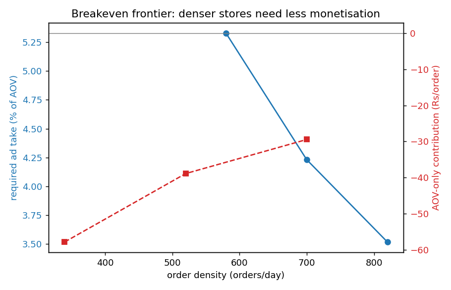
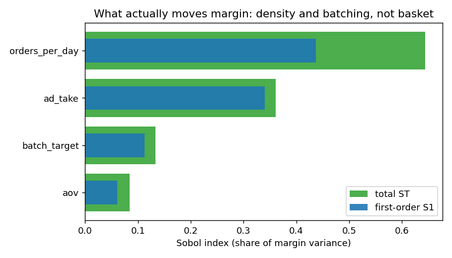

# Quick-Commerce Path-to-Profit Engine

A spatial dark-store digital twin that finds the cheapest path to profit in the
quick-commerce markets that are losing money today.

[](https://github.com/apoorvjoshi000/qcommerce-path-to-profit/actions/workflows/ci.yml)


The engine simulates one dark store from demand to dispatch to margin, calibrates
itself to published FY26 financials, and then solves for the lever combination
that crosses breakeven in a tier-2 city. The headline finding, measured not
asserted: in a sparse market the binding constraint is order density and rider
batching, not basket size.

## The problem it solves

Quick commerce (10 to 15 minute grocery delivery) is a large, fast-growing market
in India that still loses money on most orders. In FY26 Blinkit lost about Rs 3.02
per order, Zepto about Rs 78.75, and Swiggy Instamart about Rs 85.18. Roughly 6,000
dark stores operate across the country, but only around 3,600 of the top 3,800 (the
big-metro stores) are profitable. Tier-2 and tier-3 stores still bleed. The
structural reason: the cost of fulfilment (store rent, the picking roster, rider
availability) is provisioned for capacity, not per order, so in a low-density,
low-basket market that fixed cost is spread over too few orders and the per-order
economics never close.

The industry now agrees the differentiator is no longer 10 minutes, it is unit
economics at scale. The open question is structural: there is no public model that
connects the spatial drivers (population density, order arrival rate, rider travel
and batching) to per-order contribution margin, and then locates the exact lever
combination that crosses breakeven in a tier-2 density regime. Comparative P&L
decks of Blinkit vs Zepto exist. A simulation that follows a catchment all the way
to per-order margin and then solves for the cheapest path to profit does not.

**For example:** an operator wants to enter a tier-2 city at a Rs 560 basket. The
engine simulates a representative store (evening-peak Poisson arrivals, a picking
queue, single-order rider dispatch over the road graph) and reports a delivery
SLA-breach rate of about 11% and a contribution margin of **-Rs 65 per order**,
with riders sitting **60% idle** because the store only does 340 orders/day. It
then searches the lever space and finds that batching two orders per rider trip,
plus building a 4% ad take, crosses to breakeven at about 790 orders/day, while the
basket stays unchanged. Copying the metro premium-AOV playbook (push the basket to
Rs 720, no batching) never closes: it is still **-Rs 29 per order even at 700
orders/day**, because the binding constraint here is density, not basket.

## What makes it more than a spreadsheet

This is built one level above a case study so it survives technical grilling.

- **A hand-rolled discrete-event simulation** of a dark store: a binary-heap event
  loop (no SimPy), non-homogeneous Poisson arrivals generated by thinning, a finite
  picking queue, and rider dispatch with multi-drop batching over the road graph. It
  reports the full delivery-time distribution, SLA-breach rate, and rider and picker
  utilisation, so the per-order cost reflects real queueing and routing.
- **A calibration proof.** The model solves for the one hard-to-observe parameter
  (the dark-store fixed cost) so the dense metro regime reproduces Blinkit's
  published FY26 loss-per-order to the paisa, before any tier-2 extrapolation is
  trusted.
- **A from-scratch facility-location optimizer** (p-median / maximal-covering by
  greedy plus local search) with an LP-relaxation upper bound, so the placement
  quality is auditable, not asserted.
- **A derivative-free breakeven search** (a from-scratch Nelder-Mead simplex over
  the noisy simulator) that returns the minimum-effort lever mix subject to an SLA
  constraint.
- **A from-scratch Sobol global sensitivity analysis** (Saltelli sampling, Jansen
  estimators) that attributes margin variance to each lever, turning the
  recommendation from a guess into a measured ranking.

## Measured results

Reproduced by `python scripts/run_experiments.py` on an Apple M-series laptop
(macOS, Python 3.13), 20 simulation replications per configuration, Sobol N = 64.
All figures are contribution margin in rupees per order unless noted.

| Result | Number |
| --- | --- |
| Calibration proof: metro regime reproduces Blinkit FY26 | **-Rs 3.02/order**, target -Rs 3.02 (exact) |
| Calibrated dark-store fixed cost (the solved parameter) | Rs 17,217/day |
| Tier-2 lean store (340 orders/day, no batching) | **-Rs 64.9/order**, SLA breach 11.4%, riders 60% idle |
| Tier-2 cost split: fixed vs rider vs picking per order | Rs 50.6 fixed, Rs 24.7 rider, Rs 6.6 picking |
| Breakeven frontier (cheapest feasible mix) | batch 2 + ~790 orders/day + 4.3% ad take, basket unchanged, **to breakeven** |
| AOV-only strawman (premium Rs 720, no batching) | **never closes**: -Rs 56.9 at 340/day, -Rs 29.4 at 700/day |
| Sobol variance attribution | density 0.64 + batching 0.14 (**~78%**) vs basket/AOV **0.08** |
| Facility-location placement vs naive equal-spacing | **40.2%** of demand covered vs 35.7%, 0% gap to the LP bound |

The binding-constraint finding holds the whole story together: order density and
batching explain about 78% of the margin variance, while basket size explains about
8%. The cheapest path to profit is density and dispatch, not a premium basket.





## Architecture

```
 density grid (gravity/Huff catchment)
        |
        v
 dark-store discrete-event sim  -->  delivery SLA, rider/picker utilisation,
 (arrivals -> picking queue ->        realised per-order rider + picking cost
  rider dispatch + batching)
        |
        v
 contribution-margin model  <-- calibrated to FY26 loss-per-order
        |
        +--> facility-location optimizer (p-median + LP bound)
        +--> breakeven-frontier search (Nelder-Mead over the simulator)
        +--> Sobol global sensitivity (Saltelli + Jansen)
        |
        v
 Streamlit war-game + strategy memo
```

See [docs/ARCHITECTURE.md](docs/ARCHITECTURE.md) for the data flows and the design
tradeoffs, and [docs/PERF_REPORT.md](docs/PERF_REPORT.md) for the full numbers,
method, and caveats.

## Quickstart

```bash
make install          # numpy, scipy, networkx, pandas, matplotlib
make test             # 36 tests
make experiments      # full run, writes reports/results.json (~2.5 min)
make figures          # writes the frontier, Sobol and placement charts
make install-app && make app   # the Streamlit war-game
```

Or use the CLI directly:

```bash
python -m qcom.cli simulate --orders-per-day 340 --batching 1     # the lean store
python -m qcom.cli simulate --orders-per-day 790 --batching 2 --ad-take 0.04
python -m qcom.cli place --stores 6                               # placement + LP bound
python -m qcom.cli frontier --target-margin 0                     # breakeven + strawman
python -m qcom.cli sensitivity --n 32                             # Sobol indices
```

## Tests

```bash
make test
```

36 tests cover the geometry, the gravity catchment, the cost model and its
calibration, the discrete-event engine (including a regression test for the
batching dispatch bug that once looped forever), the facility-location optimizer
against its LP bound, the Nelder-Mead minimiser, and the Sobol estimators against
an analytic model with a known variance attribution. CI runs them on Python 3.10,
3.11 and 3.12 and smoke-tests the experiment driver.

## Honest limitations

The model is one city's structure, not a specific operator's full network, supply
chain or promotions. Demand is calibrated to public density and published GMV
anchors, not an operator's private order log. Second-order effects (competitor
response, demand substitution across stores) are partial. Every input is anchored
to a real figure, the dense regime is calibrated to a published loss-per-order
before any extrapolation, and the sensitivity analysis reports what actually drives
the result, so the conclusion is a decision-support tool an operator parameterises
with its own data, not a point forecast.

## References

The problem sources (FY26 financials) and the operations-research methods, with the
open-access SALib paper included, are listed in
[references/REFERENCES.md](references/REFERENCES.md).

## License

MIT, see [LICENSE](LICENSE).
